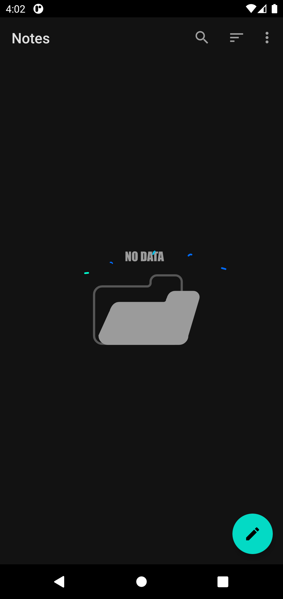
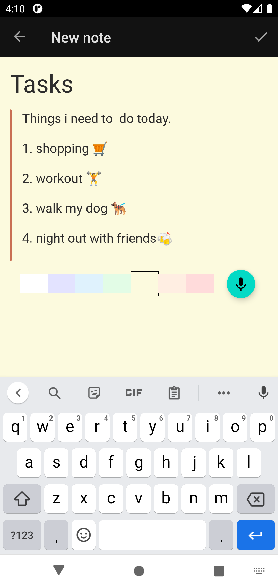
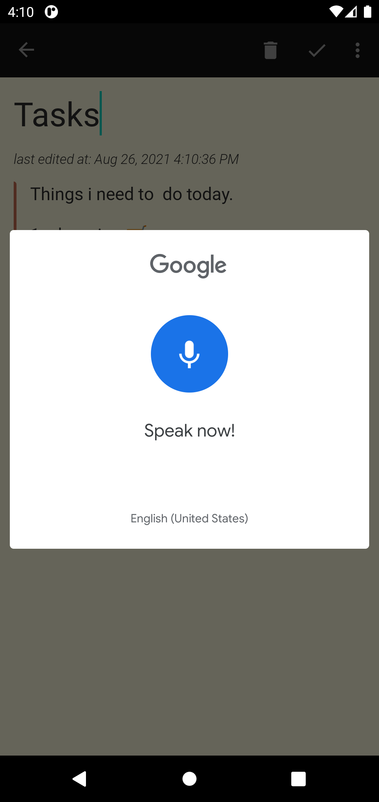
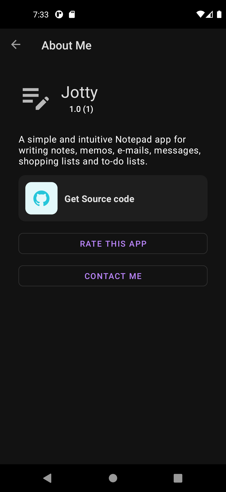
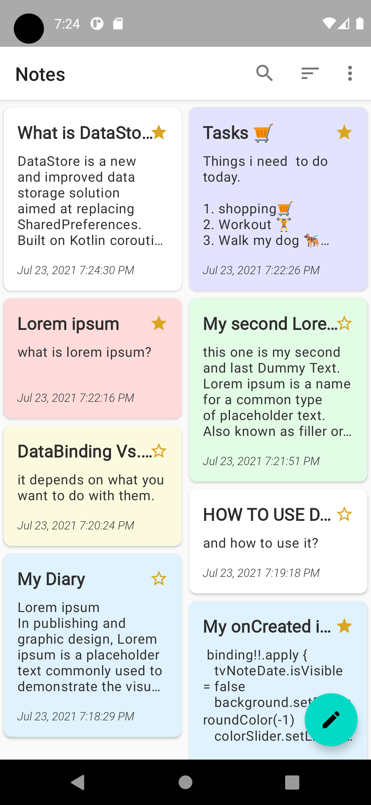
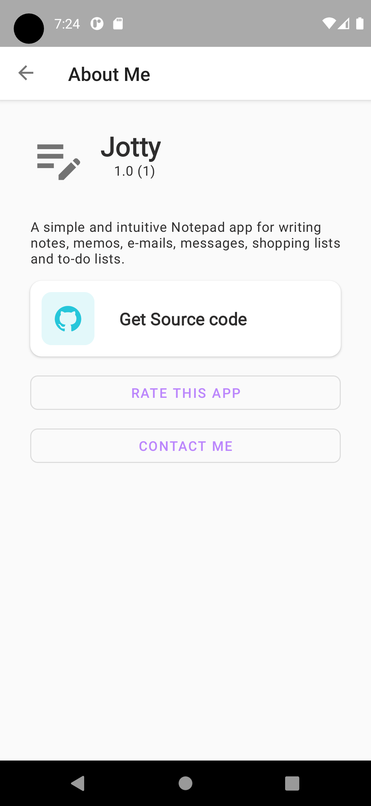

# MVVM_Notes (Jotty : Take notes with your voice)
A simple Notepad Android app ROOM, Navigation Component, MVVM, livedata, coroutines, safeargs ...

<a href="https://play.google.com/store/apps/details?id=com.codexo.notes" target="_blank">
</a>


<p float="left">
  
   
  
  
   
  
</p>

## Contributors are Welcome!❤️
if you'd like to help contribute to this project:
- fork this repo
- clone your forked repo to your local machine
- check the application and if you find bugs or would like to add some features, head over to issues tab and check if its already listed or not. then create a new issue there. 
- comment on issues you'd like to work on or send me a DM here [Eyuel](https://linkedin.com/in/eyuel-daniel)
- work on your assigned issue and push to a new branch then create a pull request


## 📝 License
This project is released under the Apache 2.0 license.
See [LICENSE](./LICENSE) for details.

```
   Copyright [2021] [Eyuel Dan]

   Licensed under the Apache License, Version 2.0 (the "License");
   you may not use this file except in compliance with the License.
   You may obtain a copy of the License at

       http://www.apache.org/licenses/LICENSE-2.0

   Unless required by applicable law or agreed to in writing, software
   distributed under the License is distributed on an "AS IS" BASIS,
   WITHOUT WARRANTIES OR CONDITIONS OF ANY KIND, either express or implied.
   See the License for the specific language governing permissions and
   limitations under the License.
```
